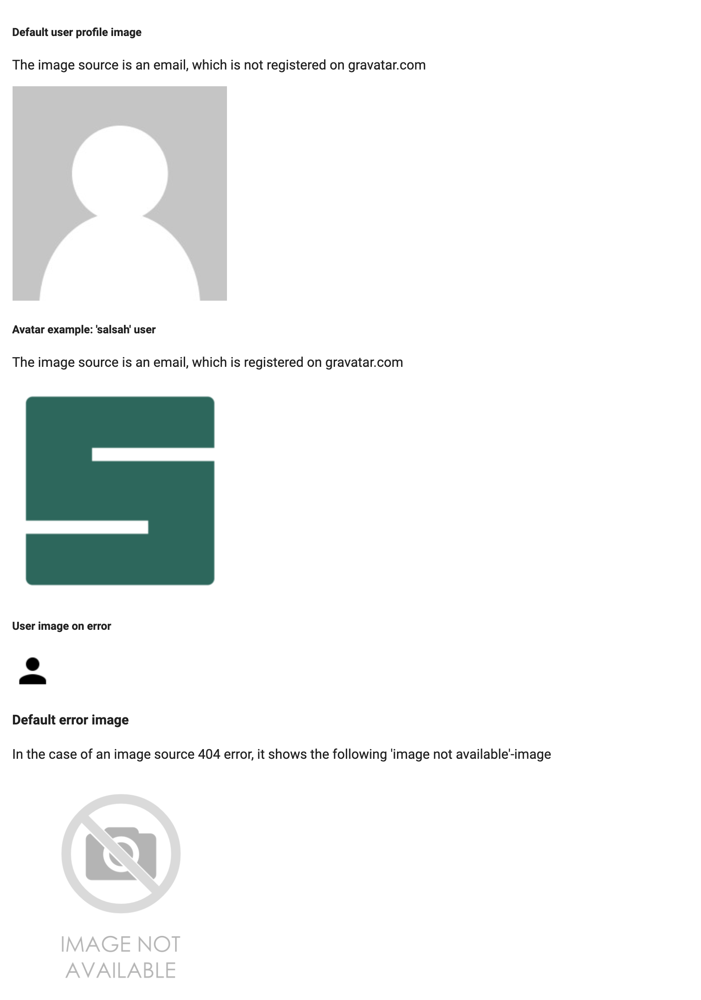
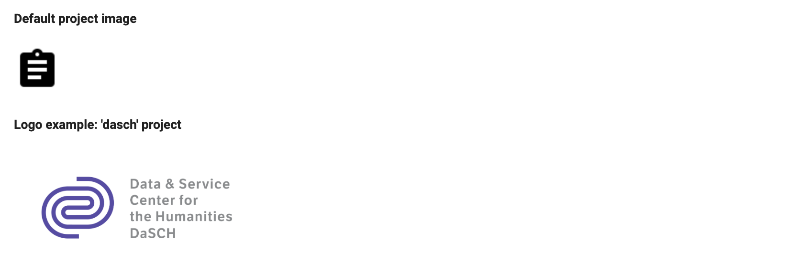

# AdminImage (Directive)

You can use the admin image module for user avatar together with gravatar.com and for project logos.

The feature of this module ist the error handling: In case of a 404 error of the image source (img src) the module shows a default image-not-found image. Or a default user profile icon (type=user), or a default project icon (type=project).

## Parameters

Name | Type | Description
--- | --- | ---
image | string | source of the image:<br> - in case of user (gr)avatar it's the e-mail address, <br> - in case of project logo it's the image url
type | string | type of image; you can use it with:<br> - project <br> - user

## Examples

### User Avatar

**HTML file**
```html
// Default user profile image


// Avatar example: 'salsah' user


// User image on error


// Default error image

```

**Typescript file**
```ts
imgDefaultUser: string = 'root@example.com';
imgSalsahUser: string = 'salsah@dasch.ch';
```



<hr>

### Project Logo

**HTML file**
```html
// Default project image


// Logo example: 'dasch' project

```

**Typescript file**
```ts
imgDefaultProject: string = undefined;
imgDaschProject: string = 'http://dasch.swiss/content/images/2017/11/DaSCH_Logo_RGB.png';
```


