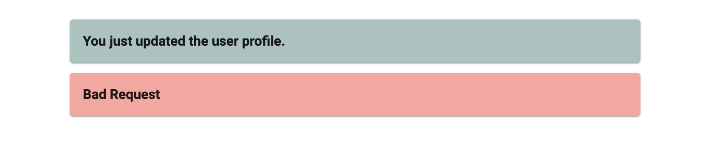
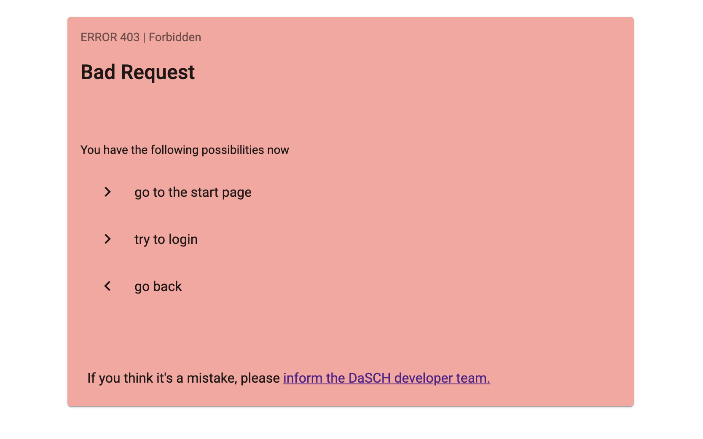

# Message (Component) - DEPRECATED

Message component to handle notes, warning and error messages.
If you set the paramater `[short]="true"`, it shows a smaller message.
It can be used to give feedbacks in a form e.g. update process: show success or error message.

## Parameters

### Message type: DspMessageData or ApiServiceError

Name | Type | Description
--- | --- | ---
message | DspMessageData, ApiServiceError | This type needs at least a status number (0-511). In this case, or if type is ApiServiceError, it takes the default status messages from the list of HTTP status codes <br> (https://en.wikipedia.org/wiki/List_of_HTTP_status_codes)

<hr>

**Show short message only: it can be used in a form to show if a post was successfull or not.**

Name | Type | Description
--- | --- | ---
short (optional) | boolean |

<hr>

**Show medium message: a message box without footnotes or links.**

Name | Type | Description
--- | --- | ---
medium (optional) | boolean |

## Examples

### Success and error message, short version (= small size)

#### HTML file

```html
<dsp-message [message]="shortMessage" [short]="true"></dsp-message>
<dsp-message [message]="errorMessage" [short]="true"></dsp-message>
```

#### Typescript file

```ts
// short message example
shortMessage: DspMessageData = {
    status: 200,
    statusMsg: 'Success',
    statusText: 'You just update the user profile.',
    type: 'Note',
    footnote: 'Close it'
};

// error message example
errorMessage: ApiServiceError = {
  status: 403,
  errorInfo:
    'Http failure response for http://0.0.0.0:3333/admin/projects/shortcode/001/members: 400 Bad Request',
  statusText: 'Bad Request',
  url: 'http://0.0.0.0:3333/admin/projects/shortcode/001/members'
};
```



<hr>

### Error message, default size

#### HTML file

```html
<dsp-message [message]="errorMessage"></dsp-message>
```

#### Typescript file

```ts
// error message example
errorMessage: ApiServiceError = {
  status: 403,
  errorInfo:
    'Http failure response for http://0.0.0.0:3333/admin/projects/shortcode/001/members: 400 Bad Request',
  statusText: 'Bad Request',
  url: 'http://0.0.0.0:3333/admin/projects/shortcode/001/members'
};
```


