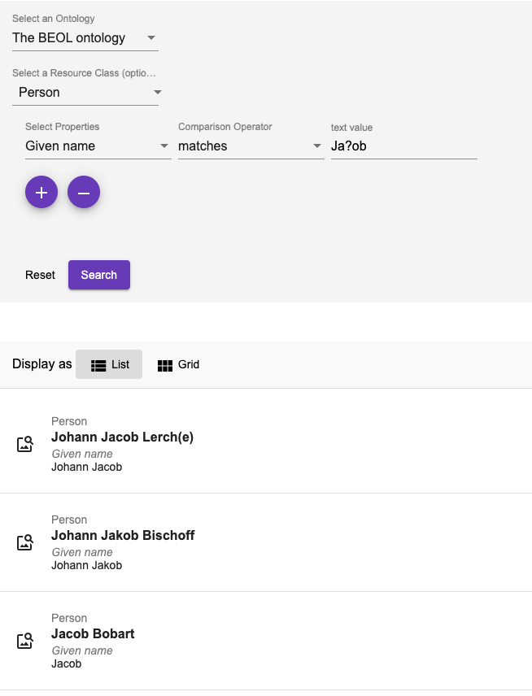
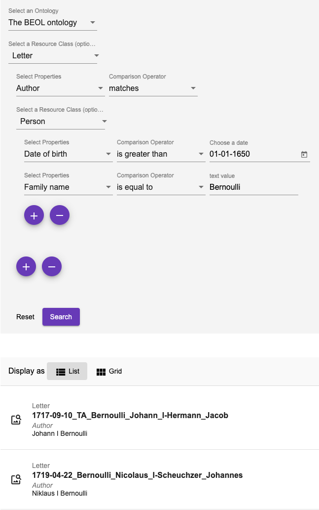

# Advanced Search Component

## Introduction

The `AdvancedSearchComponent` allows for the creation of complex queries using a graphical widget.
The widget's contents are then turned into a string representing a Gravsearch (SPAQRL) query to be sent to DSP-API.

A query consists of the following elements:
- ontology (data model) selection
- selection of a resource class belonging to the selected ontology (optional)
- specification of properties, comparison operators, and values (optional).

Although selection of a resource or a property ore both are optional, either a resource class has to be selected or at least one property has to be specified,
otherwise the query is not considered valid and cannot be submitted.

## Comparison Operators

Depending on the value type of the chosen property,
one or more of the following comparison operators can be selected:

- `is equal to`: value equality: same number, exact same string, overlap of date periods, same target resource.
- `is not equal to`: value inequality: not same number, not exact same string, no overlap of date periods, not same target resource.
- `is greater than`: value comparison: number is greater than search value, date period begins after search value.
- `is greater than or equal to` value equality / value comparison: number is equal or greater than search value, overlap of date periods or date period begins after search value.
- `is less than`: value comparison: number is less than search value, date period ends before search value.
- `is less than or equal to`: value equality / value comparison: number is equal or less than search value, overlap of date periods or date period ends before search value.
- `exists`: a value for the given property exists.
- `is like`: search value is contained in a text using the SPARQL [REGEX](https://www.w3.org/TR/sparql11-query/#func-regex) function (support of regular expressions).
- `matches`: 
   - text property: search value matches the text ([Lucene Query Parser Syntax](https://docs-api.dasch.swiss/08-lucene/lucene-query-parser-syntax/)). 
   - linking property: matches the specified linked resource.

## Search Examples

### Regular Expressions (is like)

The `is like` operator lets the user search for texts that are *like* the search value, supporting regular expressions.
In this example, all books are found whose title contains "Narrenschiff" followed by a space and some other characters like "(lat.)" or "(dt.)".

For general information about regular expressions see this [interactive tutorial](https://regexone.com).

### Lucene Parser Syntax (matches)

Used with a text property, the `matches` operator lets the user search for texts that *match* the search value,
supporting [Lucene Query Parser Syntax](https://docs-api.dasch.swiss/08-lucene/lucene-query-parser-syntax/).
In this example, all persons are found whose names contain "Ja" and "ob" with a character in between (represented by the wildcard "?").
This search finds "Jacob" as well as "Jakob".

**Note the difference between regular expressions and Lucene parser syntax!**

### Specifying a Linked Resource (matches)

Used with a linking property, the `matches` operator lets the user search for a linked resource that matches the specified properties. 
In this example, the user writes a query looking for all letters that have an author that:
1. was born after January 1st 1650
2. whose family name is "Bernoulli"

This is different from the "is equal to" operator that lets the user specify a certain person (selected from a list).

