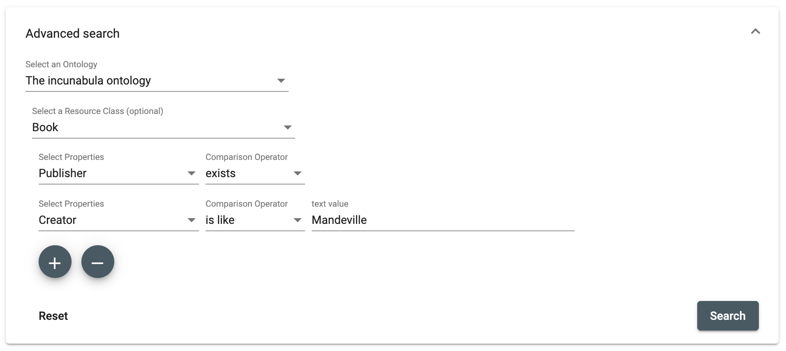

# Advanced search (Component)

The advanced search allows you to filter by project, by source type (resource class), or by the metadata (properties) of source types. Each filter can be standalone or combined. The metadata field can be precisely filtered with criteria such as "contains", "like", "equals to", "exists" or in case of a date value with "before" or "after". In addition, for a metadata field that is connected to another source type, it's possible to filter by this second source type. If you are looking for the source type "Photograph" with the metadata field "Photographer", which is connected to source type "Person", you can search for photograph(s) taken by person(s) who is born before February 1970. The result of this request will be an intersection of the two source types.

## Parameters

Name | Type | Description
 --- | --- | ---
route | string | Route to navigate after search. This route path should contain a component for search results.
toggleExtendedSearchForm | boolean | Trigger toggle for advanced search form.
gravsearch | string | Send the gravsearch query back.

## Examples

Advanced search panel

 ```html
 <!-- param route is where the router-outlet is defined for search results -->

<dsp-advanced-search [route]="'/search'"></dsp-advanced-search>

 <router-outlet></router-outlet>
 ```


