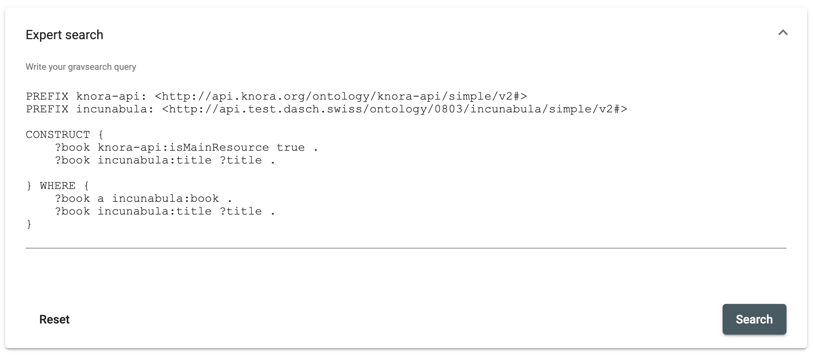

# Expert search (Component)

The expert search is a textarea field in which Gravsearch queries can be written. Complex searches can be made this way but you must know the [Gravsearch language](https://docs.knora.org/paradox/03-apis/api-v2/query-language.html).

## Parameters

Name | Type | Description
--- | --- | ---
route (optional) | string | Route to navigate after search. This route path should contain a component for search results.
gravsearch | string | Send the gravsearch query back.
toggleExpertSearchForm | boolean | Trigger toggle for advanced search form.

## Examples

Advanced search panel

```html
<!-- param gravsearch is where the gravsearch query is cached or sent to DSP-API -->

<dsp-expert-search (gravsearch)="setGravsearch($event)"></dsp-expert-search>
```


