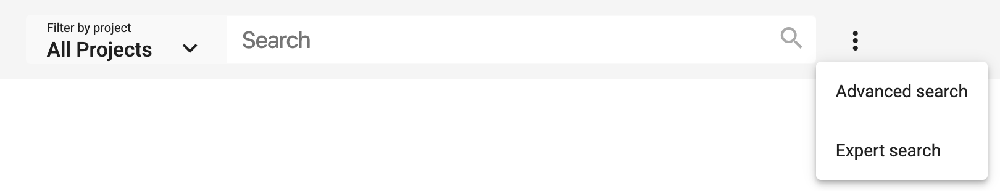

# Search panel (Component)

The search-panel contains the list of projects to filter and dsp-fulltext-search and links to dsp-advanced-search and dsp-expert-search.

## Parameters

Name | Type | Description
--- | --- | ---
route | string | Route to navigate after search. This route path should contain a component for search results.
projectfilter (optional) | boolean | If true it shows the selection of projects to filter by.
filterbyproject (optional) | string | If your full-text search should be filtered by one project, you can define it with project iri in the parameter filterbyproject
advanced (optional) | boolean | Adds the extended / advanced search to the panel
expert (optional) | boolean | Adds the expert search / gravsearch editor to the panel

## Examples

Implement the search panel in your HTML file:

```html
<dsp-search-panel
    [filterbyproject]="http://rdfh.ch/projects/0001"
    [projectfilter]="true"
    [advanced]="true"
    [expert]="true">
</dsp-search-panel>

<router-outlet></router-outlet>
```


